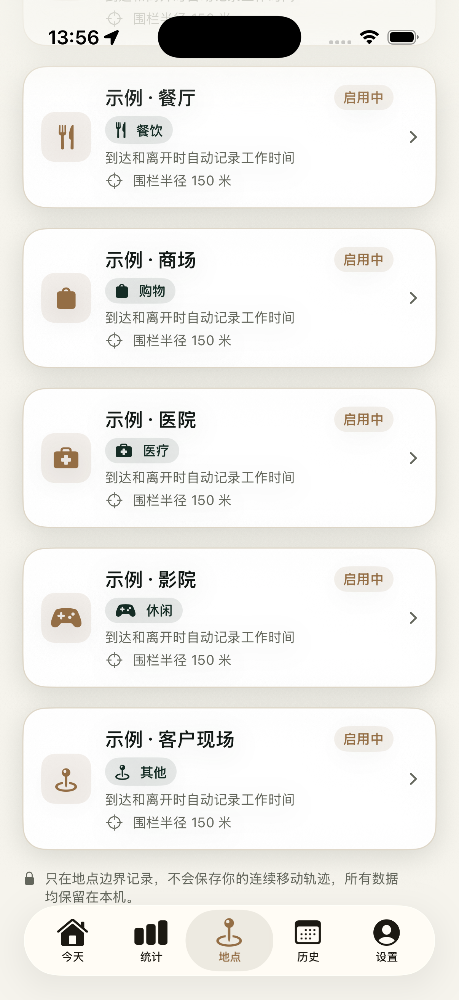
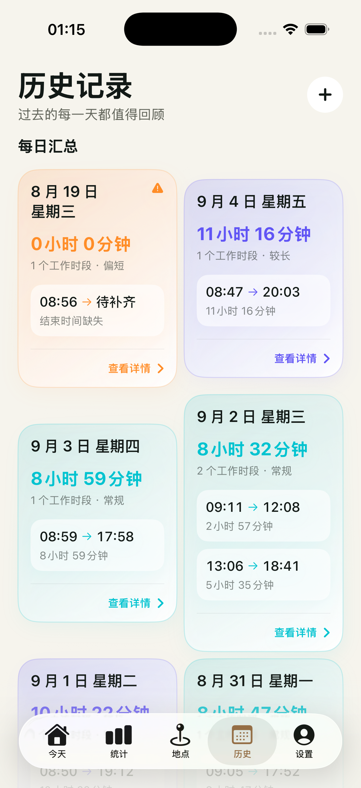
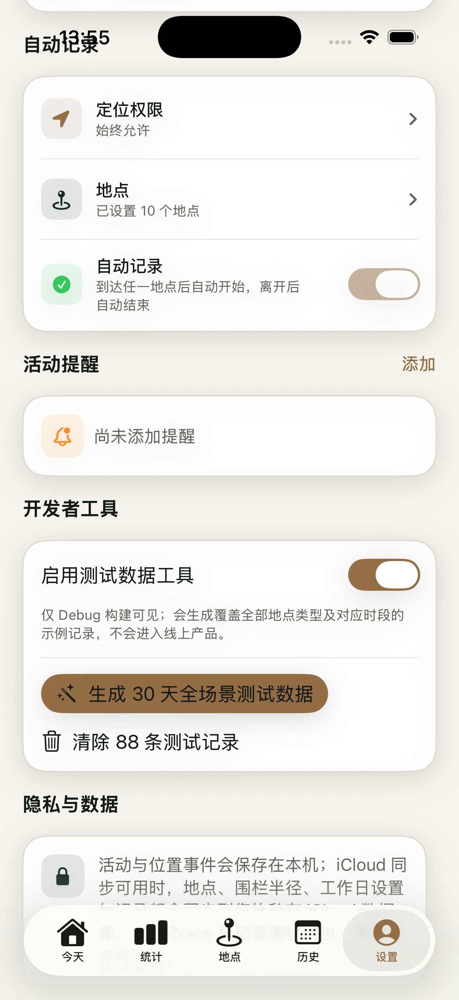

# 时迹 · TimeTrace

> 到达即记录，离开即结束。

时迹是一款以地点为线索的 iPhone 时间记录应用。为常去的工作地点、图书馆、健身房等设置地点围栏后，进入地点会自动开始记录，离开后自动结束；也可以随时手动补录与修正。

它只关心你是否进出已设置的地点边界，不保存连续移动轨迹。

## 界面预览

| 地点管理与地图 | 历史记录 | 设置 |
| --- | --- | --- |
|  |  |  |

## 功能

- 自动记录：基于 Core Location 地点围栏，在到达与离开已启用地点时记录活动时段，并提供进入、离开通知。
- 多地点管理：可添加、编辑和删除地点，设置地点名称、类型、围栏半径与工作日；地图支持查看全部地点或回到当前位置。
- 手动补录与修正：支持新增、编辑、删除记录；对缺少开始或结束事件的异常记录提供补齐或忽略操作，原始事件会保留。
- 今天与历史：展示当前进行中的记录、日汇总、待补齐记录以及最近六个月的历史。
- 统计分析：按本周、本月或自定义日期范围查看累计时长、平均时长、趋势与按地点拆分的数据。不同地点类型使用相应的统计口径。
- 活动提醒：可创建和删除本地定时提醒。
- iCloud 同步：在用户开启 App 的 iCloud 同步后，活动、地点、围栏配置、事件、会话和提醒定义会写入其私有 CloudKit 数据库；设置页会显示可操作的同步状态。
- 中文体验：当前界面与日期、时长格式均面向简体中文。

## 隐私

- 不收集连续位置轨迹，只记录已设置地点的进入与离开事件。
- 数据默认保存在设备本机。
- 启用 iCloud 后，数据仅同步到用户自己的私有 CloudKit 数据库，开发者无法读取。
- 地点围栏、通知调度属于设备运行时状态：CloudKit 同步记录后，App 会在每台设备上重新注册围栏和提醒。

完整隐私说明见 [隐私政策草案](AppStoreAssets/PRIVACY_POLICY.md)。

## 技术概览

| 层次 | 采用方案 |
| --- | --- |
| UI | SwiftUI、Swift Charts、MapKit |
| 数据 | SwiftData；可用时同步至私有 CloudKit（`iCloud.com.chronora.time.trace`） |
| 自动记录 | Core Location `CLCircularRegion` 地点围栏 |
| 通知 | UserNotifications 本地通知 |
| 记录模型 | 先追加事件，再确定性重放为会话，最后生成统计 |
| 测试 | XCTest 单元测试 |

核心数据流为：

```text
地点围栏 / 本地通知 / 手动操作
              ↓
        ActivityEvent（只追加）
              ↓
   ActivitySessionEngine（重放）
              ↓
      ActivitySession（记录时段）
              ↓
      AnalyticsService（统计）
```

项目保持单一 App Target 和单一 Test Target，不依赖第三方库。目录与领域约定可参阅 [当前架构](CURRENT_ARCHITECTURE.md) 与 [领域词汇](CONTEXT.md)。

## 本地运行

### 环境

- macOS 与 Xcode（项目当前部署目标为 iOS 26）
- iPhone 或 iOS 模拟器
- 真机自动记录需要定位权限；后台围栏、通知送达和跨设备 iCloud 同步需要在真机验证

### 步骤

1. 使用 Xcode 打开 `TimeTrace.xcodeproj`。
2. 在 Signing & Capabilities 中选择你的开发团队；如需验证 iCloud，同步配置 CloudKit 容器与签名能力。
3. 选择 iPhone 模拟器或已连接的 iPhone，运行 `TimeTrace` scheme。
4. 首次打开时完成地点设置，并在系统提示中允许定位。要体验后台自动记录，建议在真机授予“始终允许”定位权限。

也可以在仓库根目录构建：

```bash
DEVELOPER_DIR=/Applications/Xcode.app/Contents/Developer \
xcodebuild -project TimeTrace.xcodeproj -scheme TimeTrace \
  -destination 'platform=iOS Simulator,name=iPhone 17 Pro' build
```

模拟器适合验证界面与单元测试，但不能证明真实的后台围栏唤醒、系统通知送达或跨设备 CloudKit 恢复。

## 调试数据

仅在 Debug 构建中，设置页可开启“测试数据工具”，生成或清除 30 天全场景演示数据。该入口经过编译条件保护，不会出现在正式发布版本中。

## 当前边界

- 当前产品界面以“工作”作为默认活动视角；底层模型已支持活动、地点、事件、会话和提醒的通用建模，完整的活动切换界面仍待完善。
- 提醒使用系统重复本地通知；独立提醒实例和滚动预排程属于后续工作。
- `ChinaWorkCalendar` 使用内置年度数据，仍需要建立年度更新或降级提示机制。

## 贡献与反馈

欢迎通过 [GitHub Issues](https://github.com/huangbo-me/timetrace/issues) 反馈问题或建议。在提交改动前，请优先运行相关 XCTest，并在涉及定位、通知或 iCloud 时补充真机验证结果。

## 许可

暂未声明开源许可证；在获得仓库维护者书面许可前，请勿将代码用于再发布或商业用途。
